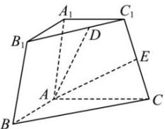

> [!faq]- 全练一本通解析
> **【答案】** A
>
> **【解析】**
> $\overrightarrow{AD} = \frac{1}{6}\vec{a} +\frac{1}{3}\vec{b} +\vec{c};\quad \overrightarrow{AE} = \frac{3}{4}\vec{b} +\frac{1}{2}\vec{c}$
> 
> 解析：
> $\overrightarrow{AD} = \overrightarrow{AA_1} + \overrightarrow{A_1C_1} + \overrightarrow{C_1D}$ $= \overrightarrow{AA_1} + \overrightarrow{A_1C_1} + \frac{1}{3}\overrightarrow{C_1B_1}$ $= \overrightarrow{AA_1} + \frac{1}{2}\overrightarrow{AC} + \frac{1}{3}\left(\frac{1}{2}\overrightarrow{AB} -\frac{1}{2}\overrightarrow{AC}\right)$ $= \frac{1}{6}\overrightarrow{AB} +\frac{1}{3}\overrightarrow{AC} +\overrightarrow{AA_1}$ $= \frac{1}{6}\vec{a} +\frac{1}{3}\vec{b} +\vec{c}.$ 所以 $AD$ 向量是 $\frac{1}{6}\vec{a} +\frac{1}{3}\vec{b} +\vec{c}.$ $\overline{AE} = \overline{AC} +\overline{CE} = \overline{AC} +\frac{1}{2}\overline{CC}_1$ $= \overline{AC} +\frac{1}{2}\left(\overline{CA} +\overline{AA_1} +\frac{1}{2}\overline{AC}\right)$ $= \frac{3}{4}\overline{AC} +\frac{1}{2}\overline{AA_1} = \frac{3}{4}\vec{b} +\frac{1}{2}\vec{c},$ 所以 $AE$ 向量为 $\frac{3}{4}\vec{b} +\frac{1}{2}\vec{c}.$
> $$
> B N = N C
> $$
> $$
> O M = 2 M A
> $$
> $$
> \overrightarrow {O N} = \frac {1}{2} (\overrightarrow {O B} + \overrightarrow {O C})
> $$
> $$
> \overrightarrow {O M} = \frac {2}{3} \overrightarrow {O A}
> $$
> $$
> \overrightarrow {M N} = \overrightarrow {O N} - \overrightarrow {O M} = \frac {1}{2} (\overrightarrow {O B} + \overrightarrow {O C}) - \frac {2}{3} \overrightarrow {O A} = - \frac {2}{3} \vec {a} + \frac {1}{2} \vec {b} + \frac {1}{2} \vec {c}
> $$
> 解析：∵ EC = 2PE，∴ $\overrightarrow{PE} = \frac{1}{3}\overrightarrow{PC}$ $\therefore \overrightarrow{DE} = \overrightarrow{AE} - \overrightarrow{AD} = \overrightarrow{AP} + \overrightarrow{PE} - \overrightarrow{AD} = \overrightarrow{AP} + \frac{1}{3}\overrightarrow{PC} - \overrightarrow{AD} = \overrightarrow{AP} + \frac{1}{3}\left(\overrightarrow{AC} - \overrightarrow{AP}\right) - \overrightarrow{AD}$ $=\frac{2}{3}\overrightarrow{AP}+\frac{1}{3}\overrightarrow{AC}-\overrightarrow{AD}=\frac{2}{3}\overrightarrow{AP}+\frac{1}{3}\overrightarrow{AC}-\overrightarrow{BC}=\frac{2}{3}\overrightarrow{AP}+\frac{1}{3}\overrightarrow{AC}-\left(\overrightarrow{AC}-\overrightarrow{AB}\right)$ $=\frac{2}{3}\overrightarrow{AP}-\frac{2}{3}\overrightarrow{AC}+\overrightarrow{AB}$ ∴ x=1, $y=-\frac{2}{3}$ , $z=\frac{2}{3}$ , $\therefore x+y+z=1$ .
>
> 故选 **A**.
