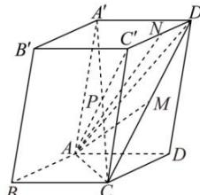

> [!faq]- 全练一本通解析
> **【答案】** （1） $\frac{1}{2}\vec{a}+\frac{1}{2}\vec{b}+\frac{1}{2}\vec{c}$ ; （2） $\frac{1}{2}\vec{a}+\vec{b}+\frac{1}{2}\vec{c}$ ; （3） $\frac{1}{2}\vec{a}+\vec{b}+\vec{c}$ .
>
> **【解析】**
> （1）连接 AC, $AD'$ , $AC'$ ,
> 
> $\overrightarrow{AP} = \frac{1}{2} (\overrightarrow{AC} + \overrightarrow{AA'}) = \frac{1}{2} (\overrightarrow{AB} + \overrightarrow{AD} + \overrightarrow{AA'}) = \frac{1}{2}\vec{a} + \frac{1}{2}\vec{b} + \frac{1}{2}\vec{c}$ ；(2） $\overrightarrow{AM} = \frac{1}{2} (\overrightarrow{AC} + \overrightarrow{AD'}) = \frac{1}{2} (\overrightarrow{AB} + 2\overrightarrow{AD} + \overrightarrow{AA'}) = \frac{1}{2}\vec{a} + \vec{b} + \frac{1}{2}\vec{c}$ ；(3） $\overrightarrow{AN} = \frac{1}{2} (\overrightarrow{AC'} + \overrightarrow{AD'}) = \frac{1}{2} [(\overrightarrow{AB} + \overrightarrow{AD} + \overrightarrow{AA'}) + (\overrightarrow{AD} + \overrightarrow{AA'})]$ $= \frac{1}{2} (\overrightarrow{AB} + 2\overrightarrow{AD} + 2\overrightarrow{AA'}) = \frac{1}{2}\vec{a} +\vec{b} +\vec{c}$
