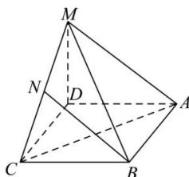

<!-- question-source:start -->
【17】(2024·上海高二上期末)如图所示,在四棱锥M-ABCD中,底面ABCD是边长为1的正方形,侧棱AM的长为2,且AM和AB,AD的夹角都是 $60^{\circ}$ ,N是CM中点,设 $\vec{a}=\overrightarrow{AB},\vec{b}=\overrightarrow{AD},\vec{c}=\overrightarrow{AM}$ ,试以 $\vec{a},\vec{b},\vec{c}$ 为基向量表示出向量 $\overrightarrow{BN}$ ,并求BN的长.

<!-- question-source:end -->

![[Q00005384A1]]
