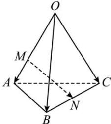

<!-- question-source:start -->
【18】(2023·浙江高二)如图, 空间四边形 OABC 中,
OA = OB = OC = 2, $\angle AOC = \angle BOC = \frac{\pi}{2}$ , $\angle AOB = \frac{\pi}{3}$ ,
点 M, N 在 OA, BC 上, 且 OM = 2MA, BN = CN.
（1）以 $\left\{\overrightarrow{OA},\overrightarrow{OB},\overrightarrow{OC}\right\}$ 为一组基底表示向量 $\overrightarrow{MN}$ ;
（2）求 MN 的长度.

<!-- question-source:end -->

![[Q00005624A1]]
