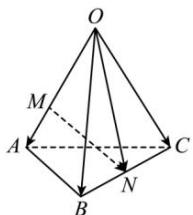

> [!faq]- 全练一本通解析
> **【答案】** （1） $\overrightarrow{MN}=-\frac{2}{3}\overrightarrow{OA}+\frac{1}{2}\overrightarrow{OB}+\frac{1}{2}\overrightarrow{OC};(2)\left|\overrightarrow{MN}\right|=\frac{\sqrt{22}}{3}$
>
> **【解析】**
> （1）∵OM=2MA,BN=CN，
> ∴ $\overrightarrow{MN}=\overrightarrow{ON}-\overrightarrow{OM}=\frac{1}{2}\left(\overrightarrow{OB}+\overrightarrow{OC}\right)-\frac{2}{3}\overrightarrow{OA}=-\frac{2}{3}\overrightarrow{OA}+\frac{1}{2}\overrightarrow{OB}+\frac{1}{2}\overrightarrow{OC}.$
> 
> (2) $OA = OB = OC = 2, \angle AOC = \angle BOC = \frac{\pi}{2}, \angle AOB = \frac{\pi}{3}$ , 所以 $\overrightarrow{OA} \cdot \overrightarrow{OC} = 0, \overrightarrow{OB} \cdot \overrightarrow{OC} = 0, \overrightarrow{OA} \cdot \overrightarrow{OB} = |\overrightarrow{OA}| |\overrightarrow{OB}| \cos \frac{\pi}{3} = 2$ , 所以 $\overline{MN}^2 = \left(-\frac{2}{3}\overrightarrow{OA} + \frac{1}{2}\overrightarrow{OB} + \frac{1}{2}\overrightarrow{OC}\right)^2$ $= \frac{4}{9}\overrightarrow{OA}^2 + \frac{1}{4}\overrightarrow{OB}^2 + \frac{1}{4}\overrightarrow{OC}^2 - \frac{2}{3}\overrightarrow{OA} \cdot \overrightarrow{OB} - \frac{2}{3}\overrightarrow{OA} \cdot \overrightarrow{OC} + \frac{1}{2}\overrightarrow{OB} \cdot \overrightarrow{OC}$ $= \frac{4}{9}\left|\overrightarrow{OA}\right|^2 + \frac{1}{4}\left|\overrightarrow{OB}\right|^2 + \frac{1}{4}\left|\overrightarrow{OC}\right|^2 - \frac{2}{3}\overrightarrow{OA} \cdot \overrightarrow{OB}$ $= \frac{4}{9} \times 2^2 + \frac{1}{4} \times 2^2 + \frac{1}{4} \times 2^2 - \frac{2}{3} \times 2 = \frac{22}{9}$ , 所以 $|\overrightarrow{MN}| = \frac{\sqrt{22}}{3}$ .
