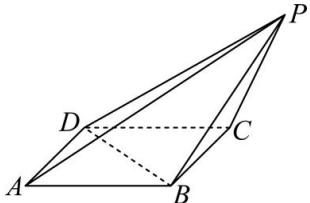

<!-- question-source:start -->
【20】（2024·安徽高二阶段练习）如图所示，在四棱锥 P-ABCD 中，底面 ABCD 是边长为 3 的菱形，且 $PC = 4, \angle ABC = \angle BCP = \angle DCP = 120^{\circ}$ ，利用空间向量证明 $PA \perp BD$ .

<!-- question-source:end -->

![[Q00005387A1]]
