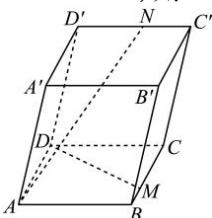

<!-- question-source:start -->
【24】（变式）平行六面体 $ABCD-A'B'C'D'$ 中，已知 $AB = AA' = AD, \angle BAD = \angle BAA' = \angle DAA' = 60^{\circ}, \overrightarrow{BM} = \frac{1}{4}\overrightarrow{BC}, N$ 为 $C'D'$ 上一点，且 $\overrightarrow{D'N} = \lambda\overrightarrow{D'C'}$ ，若 $DM \perp AN$ ，则 $\lambda = (\quad)$

A. $\frac{1}{2}$ B. $\frac{1}{3}$ C. $\frac{1}{4}$ D. $\frac{1}{5}$
<!-- question-source:end -->

![[Q00005391A1]]
