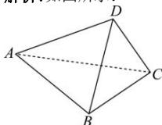

> [!faq]- 全练一本通解析
> **【答案】** 证明见解析
>
> **【解析】**
> 如图所示:
> 
> 不妨选空间的一组基底向量为 $\left\{\overrightarrow{DA},\overrightarrow{DB},\overrightarrow{DC}\right\}$ ,
> 由题意 $DA \perp BC, DB \perp AC$ ,
> 所以有 $\overrightarrow{DA} \cdot \overrightarrow{BC} = \overrightarrow{DA} \cdot (\overrightarrow{BD} + \overrightarrow{DC}) = -\overrightarrow{DA} \cdot \overrightarrow{DB} + \overrightarrow{DA} \cdot \overrightarrow{DC} = 0$ ，即 $\overrightarrow{DA} \cdot \overrightarrow{DC} = \overrightarrow{DA} \cdot \overrightarrow{DB}$ 同理有 $\overrightarrow{DB} \cdot \overrightarrow{AC} = \overrightarrow{DB} \cdot (\overrightarrow{AD} + \overrightarrow{DC}) = -\overrightarrow{DA} \cdot \overrightarrow{DB} + \overrightarrow{DB} \cdot \overrightarrow{DC} = 0$ ，即 $\overrightarrow{DB} \cdot \overrightarrow{DC} = \overrightarrow{DA} \cdot \overrightarrow{DB}$ 因此 $\overrightarrow{BA} \cdot \overrightarrow{DC} = (\overrightarrow{BD} + \overrightarrow{DA}) \cdot \overrightarrow{DC} = -\overrightarrow{DC} \cdot \overrightarrow{DB} + \overrightarrow{DC} \cdot \overrightarrow{DA} = \overrightarrow{DA} \cdot \overrightarrow{DB} - \overrightarrow{DA} \cdot \overrightarrow{DB} = 0$ 从而 $\overrightarrow{BA} \perp \overrightarrow{DC}$ ，即 $BA \perp DC$ .
