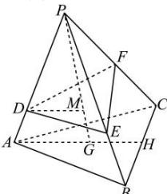

> [!faq]- 全练一本通解析
> **【答案】** 证明见详解.
>
> **【解析】**
> 
> 证明：连接 $AG$ 并延长，交 $BC$ 于点 $H$ ，由题意，
> 可令 $\{\overrightarrow{PA},\overrightarrow{PB},\overrightarrow{PC}\}$ 作为空间向量的一组基底， $\overrightarrow{PM} = \frac{3}{4}\overrightarrow{PG} = \frac{3}{4} (\overrightarrow{PA} +\overrightarrow{AG}) = \frac{3}{4}\overrightarrow{PA} +\frac{3}{4}\times \frac{2}{3}\overrightarrow{AH}$ $= \frac{3}{4}\overrightarrow{PA} +\frac{1}{2}\times \frac{\overrightarrow{AB} + \overrightarrow{AC}}{2} = \frac{3}{4}\overrightarrow{PA} +\frac{1}{4} (\overrightarrow{PB} -\overrightarrow{PA}) + \frac{1}{4} (\overrightarrow{PC} -\overrightarrow{PA})$ $= \frac{1}{4}\overrightarrow{PA} +\frac{1}{4}\overrightarrow{PB} +\frac{1}{4}\overrightarrow{PC}$ .
> 连接 $DM$ .因为点 $D,E,F,M$ 共面，所以存在唯一的实数对 $(\lambda ,\mu)$ ，使 $\overrightarrow{DM} = \lambda \overrightarrow{DE} +\mu \overrightarrow{DF}$ ，即 $\overrightarrow{PM} -\overrightarrow{PD} = \lambda (\overrightarrow{PE} -\overrightarrow{PD}) + \mu (\overrightarrow{PF} -\overrightarrow{PD})$ ，所以 $\overline{PM} = (1 - \lambda -\mu)\overline{PD} +\lambda \overline{PE} +\mu \overline{PF} = (1 - \lambda -\mu)m\overline{PA} +\lambda n\overline{PB} +\mu t\overline{PC}$ 由空间向量基本定理，知 $\frac{1}{4} = (1 - \lambda -\mu)m,\frac{1}{4} = \lambda n,\frac{1}{4} = \mu t$ 所以 $\frac{1}{m} +\frac{1}{n} +\frac{1}{t} = 4(1 - \lambda -\mu) + 4\lambda +4\mu = 4$ ，为定值.
