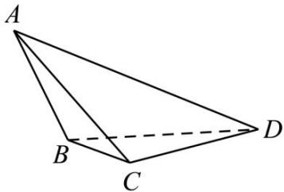

<!-- question-source:start -->
【11】如图,三棱锥 A-BCD 中,侧面 ABD,ACD 是全等的直角三角形,AD 是公共的斜边,且 $AD=\sqrt{3}$ , BD=CD=1 另一个侧面 ABC 是正三角形,试建立恰当的空间直角坐标系,求平面 ACD 的法向量.

<!-- question-source:end -->

![[Q00005507A1]]
