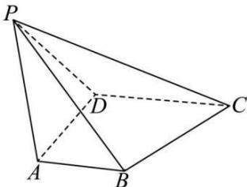

<!-- question-source:start -->
【12】如图, 四棱锥 P-ABCD, 底面 ABCD 为直角梯形, $AB \parallel CD$ , $AD \perp AB$ , DC = 2AD = 2AB = 2aPA = PD, 二面角 P-AD-B 的大小为 $135^{\circ}$ , 点 P 到底面 ABCD 的距离为 $\frac{a}{2}$ , 试建立恰当的空间直角坐标系, 求平面 PBC 的法向量.

<!-- question-source:end -->

![[Q00005508A1]]
