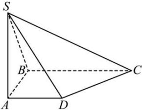

<!-- question-source:start -->
【1】(2024·全国高二专题练习) 四边形 ABCD 是直角梯形, $AD \parallel BC$ , $\angle ABC = 90^{\circ}$ , $SA \perp$ 平面 ABCD, $SA = AB = BC = 2$ , AD = 1, 试建立恰当的空间直角坐标系, 求平面 SCD 和平面 SAB 的法向量.

<!-- question-source:end -->

![[Q00005497A1]]
