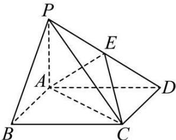

<!-- question-source:start -->
【2】（2024·河南漯河高二练习）如图，在四棱锥 P-ABCD 中，底面 ABCD 为矩形， $PA \perp$ 平面 ABCD，E 为 PD 的中点， $AB = AP = 1$ ， $AD = \sqrt{3}$ ，试建立恰当的空间直角坐标系，求平面 ACE 的一个法向量.

<!-- question-source:end -->

![[Q00005498A1]]
