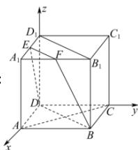

> [!faq]- 全练一本通解析
> **【答案】** $\vec{n} = (-2,2,0)$ ; $\vec{m} = (2,-2,-1)$
>
> **【解析】**
> 
> 由题意, 可得 $D(0,0,0), B(2,2,0), A(2,0,0), C(0,2,0), E(1,0,2)$ ,
> 连接 AC, 因为底面为正方形, 所以 $AC \perp BD$ ,
> 又因为 $DD_{1} \perp$ 平面 ABCD, $AC \subset$ 平面 ABCD, 所以 $DD_{1} \perp AC$ ,
> 且 $BD \cap DD_{1} = D$ ，则 $AC \perp$ 平面 $BDD_{1}B_{1}$ ∴ $\overrightarrow{AC}=(-2,2,0)$ 为平面 $BDD_{1}B_{1}$ 的一个法向量. 故平面 $BDD_{1}B_{1}$ 的向量 $\vec{n}=(-2,2,0)$ (答案不唯一). $\overrightarrow{DB}=(2,2,0),\overrightarrow{DE}=(1,0,2).$ 设平面 BDEF 的一个法向量为 $\overline{m}=(x,y,z)$ ,
> 则 $\left\{\begin{aligned}\vec{n}\cdot\overrightarrow{DB}&=0,\\ \vec{n}\cdot\overrightarrow{DE}&=0,\end{aligned}\right.$ $\therefore\left\{\begin{aligned}2x+2y&=0,\\ x+2z&=0,\end{aligned}\right.$ $\therefore\left\{\begin{aligned}y&=-x,\\ z&=-\frac{1}{2}x.\end{aligned}\right.$ 令 x=2 ，得 y=-2, z=-1. $\therefore\overrightarrow{m}=(2,-2,-1)$ 即为平面 BDEF 的一个法向量。(答案不唯一).
