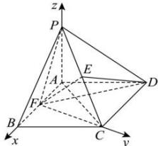

> [!faq]- 全练一本通解析
> **【答案】** $\left(\sqrt{3},2,-2\right)$
>
> **【解析】**
> 连接 PF, CF，因为 $\triangle PAB$ 是边长为 1 的正三角形，PA = PB，F 为 AB 的中点，所以 $PF \perp AB$ ，又因为平面 $PAB \perp$ 平面 ABCD，平面 $PAB \cap$ 平面 ABCD = AB， $PF \subset$ 平面 PAB，所以 $PF \perp$ 平面 ABCD。
> 连接 AC，因为 AB = BC， $\angle ABC = 60^{\circ}$ ，所以 $\triangle ABC$ 是等边三角形，又 F 为 AB 的中点，所以 $CF \perp AB$ 。
> 综上可知，直线 FB, FC, FP 两两垂直，
> 所以建立以 F 为原点，FB, FC, FP 分别为 x 轴，y 轴，z 轴的空间直角坐标系 F - xyz，如图所示：
> 
> 由题意, 在正 $\triangle PAB$ 和正 $\triangle ABC$ 中, $FP = FC = \frac{\sqrt{3}}{2}$ , 则 $F(0,0,0), D\left(-1, \frac{\sqrt{3}}{2}, 0\right), E\left(0, \frac{\sqrt{3}}{4}, \frac{\sqrt{3}}{4}\right)$ , 所以 $\overline{FE} = \left(0, \frac{\sqrt{3}}{4}, \frac{\sqrt{3}}{4}\right), \overline{FD} = \left(-1, \frac{\sqrt{3}}{2}, 0\right)$ , 设平面 $DEF$ 的一个法向量为 $\vec{n} = (x, y, z)$ , 则 $\left\{ \begin{array}{l} \vec{n} \cdot \overrightarrow{FE} = 0 \\ \vec{n} \cdot \overrightarrow{FD} = 0 \end{array} \right.$ , 即 $\left\{ \begin{array}{l} \frac{\sqrt{3}}{4} y + \frac{\sqrt{3}}{4} z = 0 \\ -x + \frac{\sqrt{3}}{2} y = 0 \end{array} \right.$ , 化简得 $\left\{ \begin{array}{l} y = -z \\ x = \frac{\sqrt{3}}{2} y \end{array} \right.$ , 令 $y = 2$ , 则 $x = \sqrt{3}, z = -2$ , 即 $\vec{n} = (\sqrt{3}, 2, -2)$ 所以平面 $DEF$ 的一个法向量为 $\vec{n} = (\sqrt{3}, 2, -2)$ （答案不唯一）.
