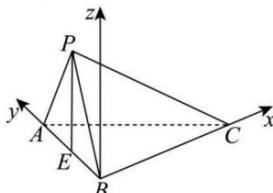

> [!faq]- 全练一本通解析
> **【答案】** $\vec{n} = (1, \sqrt{2}, 1)$
>
> **【解析】**
> 取 AB 中点 E, 连接 PE, PA = PB, 则 $PE \perp AB$ ,
> 因为平面 $PAB \perp$ 平面 ABC, 平面 $PAB \cap$ 平面 ABC = AB, 且 $PE \subset$ 平面 PAB, 所以 $PE \perp$ 平面 ABC, $BC \subset$ 平面 ABC, 所以 $PE \perp BC$ ,
> 又因为 $PA \perp BC$ , 且 $PE \cap PA = P$ , $PA \subset$ 平面 PAB, $PE \subset$ 平面 PAB,
> 所以 $BC \perp$ 平面 PAB.
> 所以得 BC, BA, PE 两两垂直, 所以以 B 为原点, BC, BA 所在的直线分别为 x, y 轴, 以过点 B 与 PE 平行的直线为 z 轴, 建立空间直角坐标系, 如图所示,
> 
> 故可得 $C\left(\frac{4\sqrt{6}}{3},0,0\right)$ ， $P\left(0,\frac{2\sqrt{3}}{3},\frac{2\sqrt{6}}{3}\right)$ ， $A\left(0,\frac{4\sqrt{3}}{3},0\right)$ ，
> 可得 $\overrightarrow{CA}=\left(-\frac{4\sqrt{6}}{3},\frac{4\sqrt{3}}{3},0\right)$ ， $\overrightarrow{PA}=\left(0,\frac{2\sqrt{3}}{3},-\frac{2\sqrt{6}}{3}\right)$ 设平面 CPA 的法向量为 $\vec{n}=(x,y,z)$ ,
> 由 $\left\{\begin{aligned}\overrightarrow{CA}\cdot\vec{n}&=0\\ \overrightarrow{PA}\cdot\vec{n}&=0\end{aligned}\right.$ 得 $\left\{\begin{aligned}-\frac{4\sqrt{6}}{3}x+\frac{4\sqrt{3}}{3}y&=0\\ \frac{2\sqrt{3}}{3}y-\frac{2\sqrt{6}}{3}z&=0\end{aligned}\right.$ 令 $y=\sqrt{2}$ ，可得 x=1，z=1，所以 $\vec{n}=(1,\sqrt{2},1)$ ，
