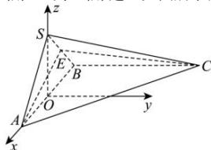

> [!faq]- 全练一本通解析
> **【答案】** $\vec{n}=\left(\sqrt{2},1,2\sqrt{2}\right)$
>
> **【解析】**
> 取 AB 中点 O, $\triangle SAB$ 为等腰直角三角形, 则 $SO \perp AB$ ,
> 面 $SAB \perp$ 面 ABC，面 $SAB \cap$ 面 ABC = AB， $SO \subset$ 面 SAB，所以 $SO \perp$ 面 ABC，
> 以点 O 为原点，OA 为 x 轴，平面 ABC 内过 O 点垂直于 AB 的直线为 y 轴，OS 为 z 轴，建立如图所示的空间直角坐标系，
> 
> 由 $AB \perp BC$ ， $\sqrt{2} AB = BC = 2$ ， $\triangle SAB$ 为等腰直角三角形， $\angle ASB = 90^{\circ}$ 得 $A\left(\frac{\sqrt{2}}{2},0,0\right),B\left(-\frac{\sqrt{2}}{2},0,0\right),C\left(-\frac{\sqrt{2}}{2},2,0\right),S\left(0,0,\frac{\sqrt{2}}{2}\right)$ .
> 点 E 为线段 SB 的三等分点（靠近点 S），
> 有 $E\left(-\frac{\sqrt{2}}{6},0,\frac{\sqrt{2}}{3}\right)$ ， $\overrightarrow{BE}=\left(\frac{\sqrt{2}}{3},0,\frac{\sqrt{2}}{3}\right)$ ， $\overrightarrow{AE}=\left(-\frac{2\sqrt{2}}{3},0,\frac{\sqrt{2}}{3}\right)$ ， $\overrightarrow{AC}=(-\sqrt{2},2,0)$ 设面 ACE 的一个法向量为 $\vec{n}=(x,y,z)$ ，则有 $\left\{\begin{aligned}\vec{n}\cdot\overrightarrow{AE}&=-\frac{2\sqrt{2}}{3}x+\frac{\sqrt{2}}{3}z=0\\ \vec{n}\cdot\overrightarrow{AC}&=-\sqrt{2}x+2y=0\end{aligned}\right.$ 令 y=1，则 $x=\sqrt{2},y=2\sqrt{2}$ ，得 $\vec{n}=\left(\sqrt{2},1,2\sqrt{2}\right)$ .
