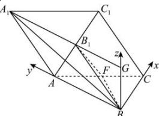

> [!faq]- 全练一本通解析
> **【答案】** 详见解析
>
> **【解析】**
> 延长 $A_{1}B_{1}$ 至 G，使 $B_{1}G=1$ ，连接 BG，因为 $\angle ABB_{1}=\frac{\pi}{3}$ ，
> 则 $BG \perp A_{1}G, BG \perp BC, AB \perp BC$ 以 B 为原点，BC,BA,BG 分别为 x,y,z 轴建立如图所示的空间直角坐标系，
> 
> 其中各点坐标为： $B(0,0,0), C(1,0,0), B_{1}(0,1,\sqrt{3}), F\left(\frac{1}{2},1,0\right)$ ， $\overrightarrow{BF}=\left(\frac{1}{2},1,0\right), \overrightarrow{BB_{1}}=\left(0,1,\sqrt{3}\right), \overrightarrow{BC}=\left(1,0,0\right)$ ，
> 设平面 $FBB_{1}$ 的一个法向量为 $\vec{n}=(x,y,z)$ ，
> 则 $\left\{\vec{n}\cdot\overrightarrow{BF}=\frac{1}{2}x+y=0\right.$ ，取 $y=-\sqrt{3}$ ，则 $x=2\sqrt{3}, z=1$ ，则 $\vec{n}=\left(2\sqrt{3},-\sqrt{3},1\right)$ ，
> 设平面 $BB_{1}C$ 的一个法向量为 $\vec{m}=(a,b,c)$ 。
> 则 $\left\{\vec{m}\cdot\overrightarrow{BC}=a=0\right.$ ，取 $b=\sqrt{3}$ ，则 $a=0,c=-1$ ，则 $\vec{m}=\left(0,\sqrt{3},-1\right)$ 。
