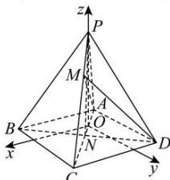

> [!faq]- 全练一本通解析
> **【答案】** $\vec{m}=\left(\sqrt{2},0,-\sqrt{3}\right)$
>
> **【解析】**
> 连接 AC，与 BD 交于点 N，连接 PN。
> 过 P 作 AC 的垂线，垂足为 $O\Rightarrow PO\perp AC$ ，
> 因为四边形 ABCD 是正方形，所以 $AC\perp BD$ 。
> 因为 PB=PD，N 为 BD 的中点，所以 $BD\perp PN$ 。
> 因为 $AC\cap PN=N$ ， $AC\subset$ 平面 PAC， $PN\subset$ 平面 PAC，
> 所以 $BD\perp$ 平面 PAC。所以 $BD\perp PO$ 因为 $AC\perp PO$ 可得： $PO\perp$ 平面 ABCD。
> 以 O 为坐标原点，过 O 且平行于 AB，AD 的直线分别为 x 轴，y 轴，OP 所在直线为 z 轴，建立如图所示的空间直角坐标系如下图所示：
> 
> 由 $AB=2\sqrt{2}$ ，得 AC=4，因为 PA=2， $PC=2\sqrt{3}$ ，
> 所以 $PA \perp PC$ ，则 $PO = \sqrt{3}$ ，AO = 1，CO = 3，
> 则 $D\left(-\frac{\sqrt{2}}{2},\frac{3\sqrt{2}}{2},0\right)$ ， $A\left(-\frac{\sqrt{2}}{2},-\frac{\sqrt{2}}{2},0\right)$ ， $P(0,0,\sqrt{3})$ ， $C\left(\frac{3\sqrt{2}}{2},\frac{3\sqrt{2}}{2},0\right)$ .
> 由 $\overrightarrow{MC}=2\overrightarrow{PM}$ 得 $M\left(\frac{\sqrt{2}}{2},\frac{\sqrt{2}}{2},\frac{2\sqrt{3}}{3}\right),\overrightarrow{AM}=\left(\sqrt{2},\sqrt{2},\frac{2\sqrt{3}}{3}\right),\overrightarrow{AD}=(0,2\sqrt{2},0)$ .
> 设平面 ADM 的法向量为 $\vec{m}=(x,y,z)$ ,
> 由 $\left\{\begin{aligned}\overrightarrow{AM}\cdot\vec{m}&=0,\\ \overrightarrow{AD}\cdot\vec{m}&=0,\end{aligned}\right.$ 得 $\left\{\begin{aligned}\sqrt{2}x+\sqrt{2}y+\frac{2\sqrt{3}}{3}z&=0,\\ 2\sqrt{2}y&=0,\end{aligned}\right.$ 令 $x=\sqrt{2}$ ，解方程组可得， $x=\sqrt{2},y=0,z=-\sqrt{3}$ 故 $\vec{m}=\left(\sqrt{2},0,-\sqrt{3}\right)$ .
