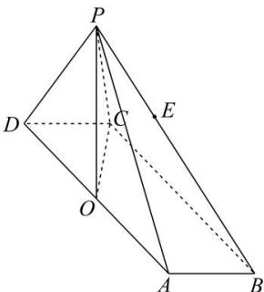

<!-- question-source:start -->
【17】(2022·黑龙江大庆模拟预测)如图,在四棱锥P-ABCD中,四边形ABCD为平行四边形,P在平面ABCD的投影为边AD的中点O, $\angle ABC=\frac{\pi}{3}$ ,BC=4,AB=1,PO=3,点E为线段BP上靠近点P的三等分点,,试建立恰当的空间直角坐标系,求平面EOC的法向量.

第五节 专题：求平面法向量专题训练
<!-- question-source:end -->

![[Q00005513A1]]
