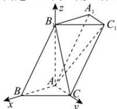

> [!faq]- 全练一本通解析
> **【答案】** $\vec{n} = (0, -\sqrt{3}, 1)$
>
> **【解析】**
> 因为 $AB_{1} \perp$ 平面 ABC，所以 $AB_{1} \perp AB$ 因为 AB = 1, $BB_{1} = 2$ , $\therefore AB_{1}=\sqrt{3}$ 如图，以 A 为原点， $\overline{AB},\overline{AC},\overline{AB_{1}}$ 的方向分别为 x 轴，y 轴，z 轴的正方向建立空间直角坐标系，
> 
> 则 $A(0,0,0),B_1(0,0,\sqrt{3}),B(1,0,0),C(0,1,0)$ $\because \overrightarrow{BB_1} = \overrightarrow{CC_1} = (-1,0,\sqrt{3}),\overrightarrow{AC} = (-1,1,0),\overrightarrow{AB} = (1,0,0)$ $\therefore \overrightarrow{AC_1} = \overrightarrow{AC} +\overrightarrow{CC_1} = (0,1,0) + (-1,0,\sqrt{3}) = (-1,1,\sqrt{3})$ 设平面 $ABC_{1}$ 的一个法向量为 $\vec{n} = (x,y,z)$ 由 $\left\{\frac{\overrightarrow{AB}\cdot\vec{n} = 0}{\overrightarrow{AC_1}\cdot\vec{n} = 0},\right.$ 得 $\left\{ \begin{array}{l}x = 0\\ -x + y + \sqrt{3} z = 0 \end{array} \right.$ ，令 $z = 1$ ，得 $y = -\sqrt{3}$ $\therefore$ 平面 $ABC_{1}$ 的一个法向量为 $\vec{n} = (0, - \sqrt{3},1)$
