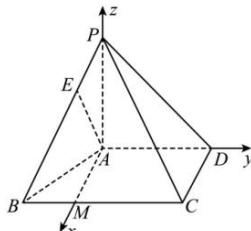

> [!faq]- 全练一本通解析
> **【答案】** $\vec{n}=(-2,0,1)$
>
> **【解析】**
> 因为 $PA \perp$ 平面 ABCD，所以， $PA \perp AD, PA \perp CD$ 因为 PA = AD = CD = 2，所以， $PD = 2\sqrt{2}$ ，
> 因为 $PC = 2\sqrt{3}$ ，
> 所以 $CD^{2} + PD^{2} = PC^{2}$ ，即 $CD \perp PD$ 因为， $PA \cap PD = P$ ，PA, $PD \subset$ 平面 PAD，
> 所以 CD⊥平面 PAD，
> 因为 AD⊂平面 PAD，
> 所以 CD⊥AD
> 因为 BC//AD
> 又因为 BC=3,AD=2,BC≠AD，
> 所以四边形 ABCD 是直角梯形.
> 在平面 ABCD 内, 过 A 作 AD 的垂线交 BC 于点 M，
> 因为 PA⊥平面 ABCD，所以， $PA \perp AD, PA \perp AM$ 所以，AP,AD,AM三条直线两两垂直，如图建立空间直角坐标系A-xyz
> 
> 则 $A(0,0,0)$ , $P(0,0,2)$ , $D(0,2,0)$ , $C(2,2,0)$ , $B(2,-1,0)$ ,
> 因为 E 为棱 PB 上的靠近点 P 的三等分点
> 所以， $\overline{AE}=\overline{AP}+\frac{1}{3}\overline{PB}=(0,0,2)+\frac{1}{3}(2,-1,-2)=\left(\frac{2}{3},-\frac{1}{3},\frac{4}{3}\right)$ ， $\overrightarrow{AD}=(0,2,0)$ ，
> 设平面 EAD 的一个法向量为 $\vec{n}=(x,y,z)$ 则 $\left\{\begin{aligned}\vec{n}\cdot\overline{AE}&=0\\ \vec{n}\cdot\overrightarrow{AD}&=0\end{aligned}\right.$ ，即 $\left\{\begin{aligned}\frac{2}{3}x-\frac{1}{3}y+\frac{4}{3}z=0\\ 2y=0\end{aligned}\right.$ ，令 z=1，则 x=-2,y=0，
> 所以， $\vec{n}=(-2,0,1)$
