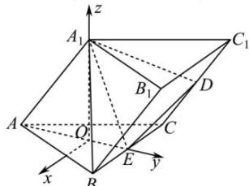

> [!faq]- 全练一本通解析
> **【答案】** $\vec{n}=\left(\frac{\sqrt{3}}{2},1,\frac{\sqrt{2}}{4}\right)$
>
> **【解析】**
> 设点 O 为 $\triangle ABC$ 的中心, 连接 $A_{1}O$ , 连接 AO 并延长交 BC 于点 E,
> 则 $AE \perp BC, A_{1}O \perp$ 平面 ABC.
> 以 O 为坐标原点, 平行于 BC 且指向 CB 的方向为 x 轴正方向, OE, $OA_{1}$ 分别为 y, z 轴建立坐标系,
> 
> $$
> A (0, - \sqrt {3}, 0) A _ {1} (0, 0, \sqrt {6}), C (- \frac {3}{2}, \frac {\sqrt {3}}{2}, 0), E (0, \frac {\sqrt {3}}{2}, 0), \overline {{{{C C _ {1}}}}} = \overline {{{{A A _ {1}}}}} = (0, \sqrt {3}, \sqrt {6})
> $$
> 所以 $\overrightarrow{CD} = \frac{1}{2}\overrightarrow{CC_1} = \left(0,\frac{\sqrt{3}}{2},\frac{\sqrt{6}}{2}\right),$ $\overline{ED} = \overline{EC} +\overline{CD} = \left(-\frac{3}{2},0,0\right) + \left(0,\frac{\sqrt{3}}{2},\frac{\sqrt{6}}{2}\right) = \left(-\frac{3}{2},\frac{\sqrt{3}}{2},\frac{\sqrt{6}}{2}\right)$ $\overline{A_1E} = \left(0,\frac{\sqrt{3}}{2}, - \sqrt{6}\right)$ 设平面 $A_{1}ED$ 的法向量为 $\vec{n} = (x,y,z)$ 则 $\left\{ \begin{array}{c}\vec{n}\cdot \overline{A_1E} = \frac{\sqrt{3}}{2} y - \sqrt{6} z = 0\\ \vec{n}\cdot \overrightarrow{ED} = -\frac{3}{2} x + \frac{\sqrt{3}}{2} y + \frac{\sqrt{6}}{2} z = 0 \end{array} ,\right.$ 取 $y = 1$ ，则 $x_{2} = \frac{\sqrt{3}}{2},z_{2} = \frac{\sqrt{2}}{4}$ ，所以 $\vec{n} = \left(\frac{\sqrt{3}}{2},1,\frac{\sqrt{2}}{4}\right)$
