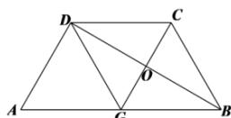
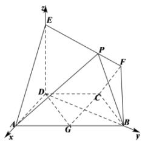

> [!faq]- 全练一本通解析
> **【答案】** （1）证明见解析；（2） $\vec{n} = \left(-4,\frac{4\sqrt{3}}{3},1\right).$
>
> **【解析】**
> （1）在梯形ABCD中， $AB / / CD,AD = DC = CB = 1,\angle BCD = 120^{\circ},\angle CBA = 60^{\circ}$ 过 $C$ 作CG//AD，因为 $AG / / CD$ ，所以四边形AGCD是平行四边形.由于 $AD = CD$ ，所以四边形AGCD是菱形， $AG = CG = 1$ 则三角形BCG是等边三角形，所以 $BG = 1$ ，所以四边形BCDG是菱形.则 $BD\bot CG$ ，则 $AD\bot BD$ .由于平面BFED⊥平面ABCD，交线为BD，而 $DE\bot BD$ 所以 $DE\bot$ 平面ABCD，则 $DE\bot AD$ 由于 $BD\cap DE = D$ ，所以 $AD\bot$ 平面BFED.
> 
> （2）以 D 为原点建立如图所示空间直角坐标系，
> $$
> A (1, 0, 0), B (0, \sqrt {3}, 0), E (0, 0, 2), F (0, \sqrt {3}, 1), C \left(- \frac {1}{2}, \frac {\sqrt {3}}{2}, 0\right),
> $$
> $$
> \therefore \overrightarrow {F E} = (0, - \sqrt {3}, 1), \overrightarrow {B F} = (0, 0, 1), \overrightarrow {B C} = \left(- \frac {1}{2}, - \frac {\sqrt {3}}{2}, 0\right),
> $$
> $$
> \because \overrightarrow {F P} = \frac {1}{3} \overrightarrow {F E} = \left(0, - \frac {\sqrt {3}}{3}, \frac {1}{3}\right),
> $$
> $$
> \therefore \overrightarrow {B P} = \overrightarrow {B F} + \overrightarrow {F P} = \left(0, - \frac {\sqrt {3}}{3}, \frac {4}{3}\right).
> $$
> 设平面 PBC 的法向量为 $\vec{n}=(x,y,z)$ ,
> 则 $\left\{\begin{aligned}\overline{n}\cdot\overline{BP}&=-\frac{\sqrt{3}}{3}y+\frac{4}{3}z=0\\ \overline{n}\cdot\overline{BC}&=-\frac{1}{2}x-\frac{\sqrt{3}}{2}y=0\end{aligned}\right.$ ，令 z=1 故可得 x=-4， $y=\frac{4\sqrt{3}}{3}$ .
> 所以 $\vec{n} = \left(-4, \frac{4\sqrt{3}}{3}, 1\right)$
> 
