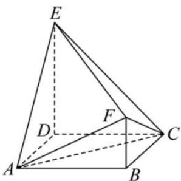

<!-- question-source:start -->
【2】如图, 多面体 ABCDEF 中, ABCD 为正方形, DE ⊥ 平面 ABCD, DE // BF, AD = DE = 2, BF = $\frac{1}{2}$ .

（1）求证： $AC\perp EF$

（2）在线段 DE 上是否存在点 G，使得直线 BG 与 AD 所成角的余弦值为 $\frac{2}{3}$ ？若存在，求出点 G 到平面 ACF 的距离，若不存在，请说明理由.

<!-- question-source:end -->

![[Q00005662A1]]
