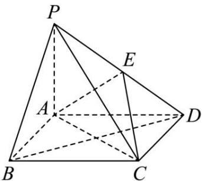

<!-- question-source:start -->
【3】（2024·广西模拟预测）如图，在四棱锥 $P - ABCD$ 中， $BD \perp PC$ ， $\angle BAD = 120^{\circ}$ ，四边形 $ABCD$ 是菱形， $PB = \sqrt{2} AB = \sqrt{2} PA$ ， $E$ 是棱 $PD$ 上的动点，且 $\overrightarrow{PE} = \lambda \overrightarrow{PD}$ .

(1) 证明: $PA \perp$ 平面 $ABCD$ .

（2）是否存在实数 $\lambda$ ，使得平面 PAB 与平面 ACE 所成锐二面角的余弦值是 $\frac{2\sqrt{19}}{19}$ ？若存在，求出 $\lambda$ 的值；若不存在，请说明理由.

第八节 专题:夹角的范围与探索性问题大题专练
<!-- question-source:end -->

![[Q00005663A1]]
