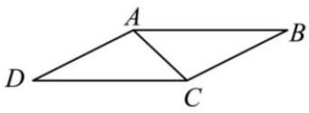
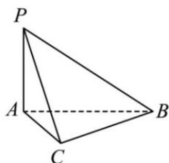

<!-- question-source:start -->
【7】如图2所示, 在 $\square ABCD$ 中, $AB = 2$ , $BC = \sqrt{3}$ , $\angle ABC = 30^{\circ}$ . 将 $\triangle DAC$ 沿 $AC$ 翻折, 使点 $D$ 到达点 $P$ 位置（如图3）, 且平面 $PAC \perp$ 平面 $PBC$ .

（1）求证: 平面 $PAC \perp$ 平面 $ABC$ ;

（2）设 $Q$ 是线段 $PB$ 上一点, 满足 $\overrightarrow{PQ} = m\overrightarrow{PB}$ , 试问: 是否存在一个实数 $m$ , 使得平面 $QAC$ 与平面 $PAB$ 的夹角的余弦值为 $\frac{\sqrt{2}}{4}$ , 若存在, 求出 $m$ 的值; 若不存在, 请说明理由.

图2

图3

第八节 专题:夹角的范围与探索性问题大题专练
<!-- question-source:end -->

![[Q00005667A1]]
