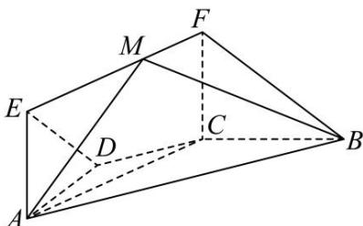

<!-- question-source:start -->
【11】（2012·浙江高二期中）如图, 在梯形 ABCD 中, $AB \parallel CD$ , AD = DC = BC = 1, $\angle ABC = 60^{\circ}$ , 四边形 ACFE 为矩形, 平面 $ACFE \perp ABCD$ , CF = 1.

（1）证明： $BC \perp$ 平面 ACFE；

（2）设点 M 在线段 EF 上运动, 平面 MAB 与平面 FCB 的夹角为 $\theta$ , 求 $\cos\theta$ 的取值范围.

第八节 专题:夹角的范围与探索性问题大题专练
<!-- question-source:end -->

![[Q00005671A1]]
