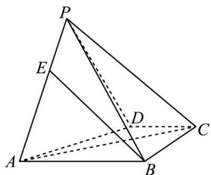

<!-- question-source:start -->
【13】（2023·宁夏银川模拟预测）如图，在四棱锥P-ABCD中，已知PA=PC，AB=BC.
（1）求证： $PB \perp AC$ ;
（2）若平面 $PCD \perp$ 平面 ABCD, AB//CD, 且 AB = 2CD = 2, $\angle ABC = 90^{\circ}$ , 二面角 P - BC - D 大小为 $45^{\circ}$ , 点 E 是线段 AP 上的动点, 求直线 EB 与平面 PAD 所成角的正弦值的最小值, 并说明此时点 E 的位置.

第八节 专题:夹角的范围与探索性问题大题专练
<!-- question-source:end -->

![[Q00005673A1]]
