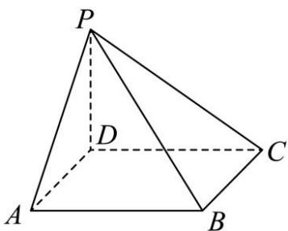

<!-- question-source:start -->
【14】（2024·河北高三）如图,四棱锥 P-ABCD 的底面为正方形, $PD \perp$ 底面 ABCD. 设平面 PAD 与平面 PBC 的交线为 l.

（1）证明： $l \perp$ 平面 PDC；

（2）已知 $PD = AD = 2, Q$ 为 $l$ 上的点，求 $PB$ 与平面 $QCD$ 所成角的正弦值的最大值.

<!-- question-source:end -->

![[Q00005674A1]]
