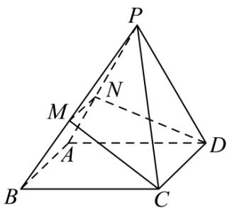

<!-- question-source:start -->
【15】（2024·海南海口）已知四棱锥 P-ABCD 的底面为矩形，AD=2AB=2，过 CD 作平面 $\alpha$ ，分别交侧棱 PA, PB 于 M, N 两点，且 MN⊥PA.

（1）求证： $CD \perp PD$ ；

（2）若 $\triangle PAD$ 是等边三角形, 求直线 PC 与平面 $\alpha$ 所成角的正弦值的取值范围.

第八节 专题:夹角的范围与探索性问题大题专练
<!-- question-source:end -->

![[Q00005675A1]]
