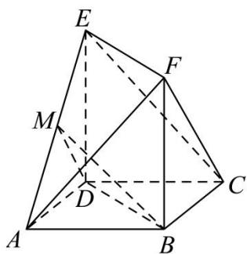

<!-- question-source:start -->
【20】如图, 在多面体 ABCDEF 中, 四边形 ABCD 是正方形, $\left|BF\right|=\left|DE\right|$ , BF // DE, M 是 AE 的中点.
（1）求证：平面 BDM // 平面 CEF；
（2）若 $DE \perp$ 平面 ABCD, $\left|AB\right| = 2$ , $BM \perp CF$ , 点 P 为线段 CE 上一点, 求直线 PM 与平面 AEF 所成角的正弦值的最大值.

<!-- question-source:end -->

![[Q00005680A1]]
