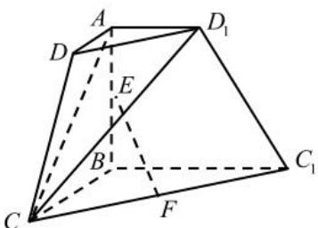

<!-- question-source:start -->
【22】（2024·四川达州二模）如图,在直角梯形ABCD中， $AD//BC$ ， $AB\perp BC$ ，AB=BC=2AD，
把梯形 ABCD 绕 AB 旋转至 $ABC_{1}D_{1}$ ，E，F 分别为 AB， $CC_{1}$ 中点.
（1）证明：EF//平面 $CD_{1}A$ ;
(2) 若 $\angle DAD_{1} = \theta (0 < \theta < \pi)$ ，求二面角 $C - AD_{1} - C_{1}$ 余弦的最小值.

<!-- question-source:end -->

![[Q00005682A1]]
