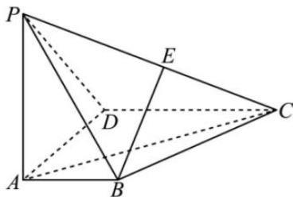

<!-- question-source:start -->
【4】如图,在四棱锥 P-ABCD 中,底面 ABCD 是直角梯形, $AD \perp AB$ , $AB \parallel DC$ , $PA \perp$ 底面 ABCD, $AD = DC = AP = 2AB = 2$ ,点 E 为棱 PC 的中点.

(2)在棱PC上是否存在点F,使二面角F-AD-C的余弦值为 $\frac{\sqrt{10}}{10}$ ,若存在,求出 $\frac{PF}{PC}$ 的值,若不存在,请说明理由.

<!-- question-source:end -->

![[Q00005664A1]]
