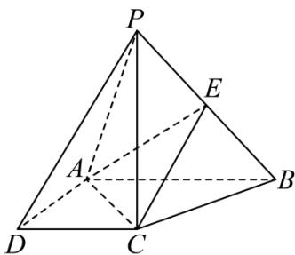

<!-- question-source:start -->
【9】（2024·四川成都模拟）四棱锥 P-ABCD 中，已知 $AB \parallel CD$ ， $AB \perp AD$ ，AB = 2AD = 2CD = 2， $BC \perp PA$ ， $PA = \sqrt{6}$ ，PC = 2，E 是线段 PB 上的点。（1）求证： $PC \perp$ 底面 ABCD；

（2）是否存在点 E 使得 PA 与平面 EAC 所成角的余弦值为 $\frac{\sqrt{5}}{3}$ ？若存在，求出 $\frac{BE}{BP}$ 的值；若不存在，请说明理由.

第八节 专题:夹角的范围与探索性问题大题专练
<!-- question-source:end -->

![[Q00005669A1]]
