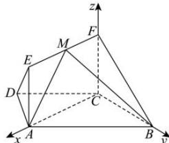

> [!faq]- 全练一本通解析
> **【答案】** （1）证明见解析（2）存在， $\sqrt{3}$
>
> **【解析】**
> （1）因为 AB//CD，AD = DC = CB = 2， $\angle DAC = 30^{\circ}$ ，
> 所以 $\angle DCA = 30^{\circ}$ ， $\angle ADC = 120^{\circ}$ ，故 $\angle DCB = 120^{\circ}, \therefore \angle ACB = \angle DCB - \angle DCA = 120^{\circ} - 30^{\circ} = 90^{\circ}$ 所以 BC ⊥ AC，又因为平面 ACFE ⊥ 平面 ABCD，平面 ACFE ∩ 平面 ABCD = AC，BC ⊂ 平面 ABCD；
> 所以 BC ⊥ 平面 ACFE；
> （2）以 C 为坐标原点建立如图所示的空间直角坐标系，
> 设 FM = m, $0 \leq m \leq 2\sqrt{3}$ ，则 $A(2\sqrt{3}, 0, 0)$ ， $B(0, 2, 0)$ ， $M(m, 0, 1)$ ， $\overline{AB} = (-2\sqrt{3}, 2, 0)$ ， $\overline{AM} = (m - 2\sqrt{3}, 0, 1)$ ，
> 设平面 ABM 的法向量为 $\vec{n} = (x, y, z)$ ，
> 由 $\left\{\begin{aligned}\vec{n} & \cdot \\ \vec{n} & \cdot \\ \vec{AB} & = 0\end{aligned}\right.$ 可得： $\left\{\begin{aligned}-2\sqrt{3}x + 2y &= 0\\ (m - 2\sqrt{3})x + z &= 0\end{aligned}\right.$ 令 x = 1，则 $\vec{n} = (1, \sqrt{3}, 2\sqrt{3} - m)$ ，取平面 BCF 的法向量为 $\vec{m} = (1, 0, 0)$ ， $|\cos\vec{m}, \vec{n}| = \frac{|\vec{m} \cdot \vec{n}|}{|\vec{m}| |\vec{n}|} = \frac{1}{\sqrt{4 + (2\sqrt{3} - m)^2}} = \frac{\sqrt{7}}{7}$ ，解得： $m = \sqrt{3}$ 或 $m = 3\sqrt{3}$ ，
> 由于 $0 \leq m \leq 2\sqrt{3}$ ，故 $m = \sqrt{3}$ ，即：FM 的长度为 $\sqrt{3}$ 。
> 
