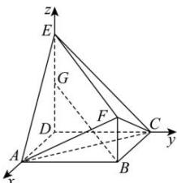

> [!faq]- 全练一本通解析
> **【答案】** （1）证明见解析（2） $\sqrt{2}$
>
> **【解析】**
> （1）因为四边形ABCD为正方形， $DE\bot$ 平面ABCD，如图以 $D$ 为原点，分别以 $DA,DC,DE$ 的方向为 $x,y,z$ 轴的正方向，建立空间直角坐标系，则 $D(0,0,0),A(2,0,0),B(2,2,0),C(0,2,0),E(0,0,2),F\left(2,2,\frac{1}{2}\right)$
> 
> $$
> \overrightarrow {A C} = (- 2, 2, 0), \overrightarrow {E F} = \left(2, 2, - \frac {3}{2}\right)
> $$
> $$
> \overrightarrow {A C} \cdot \overrightarrow {E F} = - 2 \times 2 + 2 \times 2 + 0 = 0
> $$
> $$
> \overrightarrow {A C} \perp \overrightarrow {E F}
> $$
> $$
> A C \perp E F
> $$
> (2)设线段 DE 上存在一点 $G(0,0,h),0 \leq h \leq 2$ ，使得 BG 与 AD 所成角的余弦值为 $\frac{2}{3}$ ，
> 则 $\overrightarrow{BG}=(-2,-2,h)$ ，又 $\overrightarrow{AD}=(-2,0,0)$ ，
> 所以 $\left|\cos\overrightarrow{BG},\overrightarrow{AD}\right|=\left|\frac{4}{\sqrt{8+h^{2}}\times2}\right|=\frac{2}{3}$ ，解得 h=1 （负值舍去），
> 所以存在 $G(0,0,1)$ 满足条件，
> 所以 $\overrightarrow{AG}=(-2,0,1)$ ，依题意可得 $\overrightarrow{AC}=(-2,2,0),\overrightarrow{AF}=\left(0,2,\frac{1}{2}\right)$ 设 $\vec{n}=(x,y,z)$ 为平面 ACF 的法向量，
> 则 $\left\{\begin{aligned}\overrightarrow{AC}\cdot\vec{n}&=-2x+2y=0\\\overrightarrow{AF}\cdot\vec{n}&=2y+\frac{1}{2}z=0\end{aligned}\right.$ ，设 x=1，可得 $\vec{n}=(1,1,-4)$ ，
> 所以点 $G$ 到平面 $ACF$ 的距离为 $\frac{\left|\overrightarrow{AG} \cdot \vec{n}\right|}{\left|\vec{n}\right|} = \frac{6}{3\sqrt{2}} = \sqrt{2}$ .
