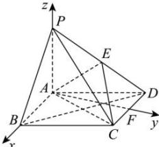

> [!faq]- 全练一本通解析
> **【答案】** （1）证明见解析（2）存在实数 $\lambda=\frac{1}{3}$ ，理由见解析
>
> **【解析】**
> （1）
> 因为四边形 ABCD 是菱形，所以 $BD \perp AC$ 。
> 因为 $BD \perp PC, AC, PC \subset$ 平面 PAC，且 $AC \cap PC = C$ ，所以 $BD \perp$ 平面 PAC。
> 因为 $PA \subset$ 平面 PAC，所以 $BD \perp PA$ 。
> 因为 $PB = \sqrt{2} AB = \sqrt{2} PA$ ，所以 $PB^{2} = AB^{2} + PA^{2}$ ，即 $AB \perp PA$ 。
> 因为 AB， $BD \subset$ 平面 ABCD，且 $AB \cap BD = B$ ，所以 $PA \perp$ 平面 ABCD。
> （2）
> 取棱 CD 的中点 F，连接 AF，因为四边形 ABCD 是菱形， $\angle BAD = 120^{\circ}$ ，
> 所以 $\triangle ACD$ 为等边三角形，故 $AF \perp CD$ ，
> 又 $PA \perp$ 平面 ABCD， $AB, AF \subset$ 平面 ABCD，
> 所以 $PA \perp AB, PA \perp AF$ ，故 AB，AF，AP 两两垂直，
> 故以 A 为原点，分别以 $\overline{AB}, \overline{AF}, \overline{AP}$ 的方向为 x, y, z 轴的正方向，建立空间直角坐标系.
> 
> 设 AB=2，则 $A(0,0,0)$ ， $C(1,\sqrt{3},0)$ ， $D(-1,\sqrt{3},0)$ ， $P(0,0,2)$ ，
> 故 $\overrightarrow{AC}=\left(1,\sqrt{3},0\right)$ ， $\overrightarrow{PD}=\left(-1,\sqrt{3},-2\right)$ ， $\overrightarrow{AP}=\left(0,0,2\right)$ ，
> 所以 $\overrightarrow{AE}=\overrightarrow{AP}+\overrightarrow{PE}=\overrightarrow{AP}+\lambda\overrightarrow{PD}=\left(-\lambda,\sqrt{3}\lambda,2-2\lambda\right)$ 设平面 ACE 的法向量为 $\vec{n}=(x,y,z)$ ,
> 则 $\left\{\begin{aligned}\vec{n}\cdot\overrightarrow{AC}&=x+\sqrt{3}y=0\\\vec{n}\cdot\overrightarrow{AE}&=-\lambda x+\sqrt{3}\lambda y+(2-2\lambda)z=0\end{aligned}\right.$ 令 $x=\sqrt{3}$ ，得 $\vec{n}=\left(\sqrt{3},-1,\frac{\sqrt{3}\lambda}{1-\lambda}\right)$ .
> 平面 PAB 的一个法向量为 $\vec{m}=(0,1,0)$ ，设面 PAB 与面 ACE 所成的锐二面角为 $\theta$ ，
> 则 $\cos\theta=\left|\cos\vec{n},\vec{m}\right|=\frac{\left|\vec{n}\cdot\vec{m}\right|}{\left|\vec{n}\right|\left|\vec{m}\right|}=\frac{1}{\sqrt{4+\frac{3\lambda^{2}}{\lambda^{2}-2\lambda+1}}}=\frac{2\sqrt{19}}{19}$ 整理得 $3\lambda^{2}+2\lambda-1=0$ ，解得 $\lambda=\frac{1}{3}$ 或 $\lambda=-1$ （舍去）.
> 故存在实数 $\lambda=\frac{1}{3}$ ，使得面 PAB 与面 ACE 所成锐二面角的余弦值是 $\frac{2\sqrt{19}}{19}$ .
