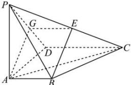
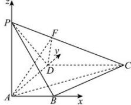

> [!faq]- 全练一本通解析
> **【答案】** （1）证明见解析（2）存在， $\frac{PF}{PC}=\frac{1}{4}$
>
> **【解析】**
> （1）在 $PD$ 上找中点 $G$ ，连接 $AG, EG,$ 如图：
> 
> ∵ G 和 E 分别为 PD 和 PC 的中点，
> ∴ EG // CD，且 $EG = \frac{1}{2} CD$ ，
> 又∵底面 ABCD 是直角梯形，CD = 2AB，AB // CD，
> ∴ AB // GE 且 AB = GE。即四边形 ABEG 为平行四边形，
> ∴ AG // BE，
> ∵ AG ⊂ 平面 PAD, BE ∉ 平面 PAD,
> ∴ BE // 平面 PAD;
> （2）因为 PA⊥平面 ABCD, AB, AD ⊂ 平面 ABCD，
> 所以 PA⊥AB, PA⊥AD，又 AB⊥AD，
> 以 A 为原点，以 AB 所在直线为 x 轴，AD 所在直线为 y 轴，AP 所在直线为 z 轴, 建立如图所示的空间直角坐标系,
> 
> 可得 $B(1,0,0)$ ， $C(2,2,0)$ ， $D(0,2,0)$ ， $P(0,0,2)$ ， $\overrightarrow{PC}=(2,2,-2)$ ，
> 由 F 为棱 PC 上一点，设 $\overrightarrow{PF}=\lambda\overrightarrow{PC}=(2\lambda,2\lambda,-2\lambda),0\leq\lambda\leq1$ $\overrightarrow{AF}=\overrightarrow{AP}+\overrightarrow{PF}=(2\lambda,2\lambda,2-2\lambda)$ ， $\overrightarrow{AD}=(0,2,0)$ 设平面 FAD 的法向量为 $\vec{n}=(a,b,c)$ ,
> 由 $\left\{\begin{aligned}\vec{n}\cdot\overrightarrow{AF}&=0\\ \vec{n}\cdot\overrightarrow{AD}&=0\end{aligned}\right.$ 可得 $\left\{\begin{aligned}2\lambda a+2\lambda b+(2-2\lambda)c=0\\ 2b=0\end{aligned}\right.$ ，解得：b=0，
> 令 $c=\lambda$ ，则 $a=\lambda-1$ ，则 $\vec{n}=(\lambda-1,0,\lambda)$ ，
> 取平面 ADC 的法向量为 $\vec{m}=(0,0,1)$ ，
> 则二面角 F-AD-C 的平面角 $\alpha$ 满足： $\left|\cos\alpha\right|=\frac{\left|\vec{m}\cdot\vec{n}\right|}{\left|\vec{m}\right|\cdot\left|\vec{n}\right|}=\frac{\left|\lambda\right|}{\sqrt{\left(\lambda-1\right)^{2}+\lambda^{2}}}=\frac{\sqrt{10}}{10}$ 解得： $8\lambda^{2}+2\lambda-1=0$ ，解得： $\lambda=\frac{1}{4}$ 或 $\lambda=-\frac{1}{2}$ （舍去），故存在满足条件的点 F，此时 $\frac{PF}{PC}=\frac{1}{4}$ .
