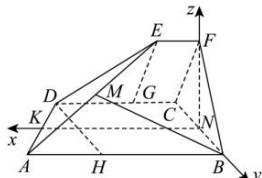

> [!faq]- 全练一本通解析
> **【答案】** 详见解析
>
> **【解析】**
> （1）证明见解析（2）存在点 M，使得二面角 M-BC-F 的大小为 $45^{\circ}$ ， $AM=\frac{5}{7}AE$ 。
> $$
> A B C D
> $$
> $$
> E F C D
> $$
> 所以 $DC \perp CF$ ， $DC \perp CB$ ，且 $CF \cap CB = C, CF, CB \subset$ 平面 BCF，
> 所以， $DC \perp$ 平面 BCF，
> 因为 $DC \subset$ 平面 ABCD，所以平面 $ABCD \perp$ 平面 BCF。
> （2）过点 E、D 分别作直线 DC、AB 的垂线 EG、DH 垂足为 G、H。
> 由已知和平面几何知识易
> 知， $DG = AH = 2$ ， $\angle EFC = \angle DCF = \angle DCB = \angle ABC = 90^{\circ}$ 则四边形 EFCG 和四边形 DCBH 是矩形，所以在 Rt△EGD 和 Rt△DHA 中， $EG = DH = 2\sqrt{3}$ ，
> 假设在 AE 上存在点 M，使得二面角 M - BC - F 的大小为 $45^{\circ}$ .
> 由（1）知 $DC \perp$ 平面 BCF，则 $\angle BCF$ 是二面角 F - DC - B 的平面角，
> 所以 $\angle BCF = 60^{\circ}$ ，所以 $\triangle BCF$ 是正三角形.
> 取 BC 的中点 N，则 $FN \perp BC$ ，又 $FN \subset$ 平面 BCF，
> 所以 $FN \perp$ 平面 ABCD，过点 N 作 AB 平行线 NK，
> 则以点 N 为原点，NK，NB、NF 所在直线分别为 x 轴、y 轴、z 轴建立空间直角坐标系 N-xyz，
> 设 $AM = \lambda AE(0 \leq \lambda \leq 1)$ ，则 $A(5,\sqrt{3},0)$ ， $B(0,\sqrt{3},0)$ ， $C(0,-\sqrt{3},0)$ ， $E(1,0,3)$ ，
> 则 $M(5-4\lambda,\sqrt{3}-\sqrt{3}\lambda,3\lambda)$ ，则 $\overline{BM}=(5-4\lambda,-\sqrt{3}\lambda,3\lambda)$ ， $\overline{BC}=(0,-2\sqrt{3},0)$ ，
> 设平面 BCM 的法向量为 $\vec{n}_{1}=(x,y,z)$ 由 $\left\{\begin{aligned}\vec{n}_{1}\cdot\overline{BC}&=0\\ \vec{n}_{1}\cdot\overline{BM}&=0\end{aligned}\right.$ ，得 $\left\{\begin{aligned}-2\sqrt{3}y&=0\\ (5-4\lambda)x-\sqrt{3}\lambda y+3\lambda z&=0\end{aligned}\right.$ ，取 $\vec{n}_{1}=\left(1,0,\frac{4\lambda-5}{3\lambda}\right)$ ，
> 又平面 BCF 的法向量 $\vec{n}_{2}=(1,0,0)$ ，所以 $\cos45^{\circ}=\frac{\left|\vec{n}_{1}\cdot\vec{n}_{2}\right|}{\left|\vec{n}_{1}\right|\cdot\vec{n}_{2}}=\frac{1}{1\cdot\sqrt{1+\left(\frac{4\lambda-5}{3\lambda}\right)^{2}}}$ 整理化简的 $7\lambda^{2}-40\lambda+25=0$ ，解得 $\lambda=\frac{5}{7}$ 或 $\lambda=5$ （舍去）.
> 所以有布点 M，使得三面角 M，BC，F 的大小为 A50，且 A1M， $^{5}A_{F}$
> $$
> M - B C - F
> $$
> $$
> A M = \frac {5}{7} A E
> $$
> 
