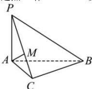

> [!faq]- 全练一本通解析
> **【答案】** （1）证明见解析（2）存在, $m = \frac{1}{2}$
>
> **【解析】**
> （1）在 $\triangle ABC$ 中，由余弦定理得 $AC^2 = \sqrt{3}^2 + 1^2 - 2 \times \sqrt{3} \times 1 \times \frac{\sqrt{3}}{2} = 1$ ， $\therefore AC^2 + BC^2 = 1^2 + \sqrt{3}^2 = 4 = AB^2$ ， $\therefore CB \perp CA$
> $$
> A M \perp P C
> $$
> $$
> P C \text { 于 }
> $$
> 
> 又平面 $PAC \perp$ 平面 $PBC$ ，且平面 $PAC \cap$ 平面 $PBC = PC$ 由 $AM \subset$ 平面 $PAC$ ，
> 所以 $AM \perp$ 平面 $PBC$ ，又 $BC \subset$ 平面 $PBC$ ，
> 所以 $AM \perp BC$ ，又 $BC \perp AC$ ， $AC \cap AM = A$ ，
> 所以 $BC \perp$ 平面 $PAC$ ，又 $BC \subset$ 平面 $ABC$ ，
> 所以平面 $PAC \perp$ 平面 $ABC$ .
> （2）由题知 $DA \perp AC$ ，即 $PA \perp AC$ ，
> 由（1）知 $PA \perp BC$ ，且 $AC \cap BC = C$ $PA \perp$ 平面 $ABC$ ，所以以 $A$ 为原点，建立如图所示的空间直角坐标系，则 $P\left(0,0,\sqrt{3}\right), B(0,2,0), C\left(\frac{\sqrt{3}}{2}, \frac{1}{2}, 0\right)$ $\therefore \overrightarrow{AQ} = \overrightarrow{AP} + \overrightarrow{PQ} = \overrightarrow{AP} + m\overrightarrow{PB} = (0,0,\sqrt{3}) + m(0,2, -\sqrt{3}) = (0,2m,\sqrt{3}(1 - m))$ 设 $\overline{n_1} = (x,y,z)$ 为平面 $QAC$ 的法向量，
> 由 $\left\{\overline{n_1} \perp \overrightarrow{AC}\right. \Rightarrow \left\{\overline{n_1} \cdot \overrightarrow{AC} = 0\right. \Rightarrow \left\{\begin{array}{l}\sqrt{3} x + y = 0 \\ 2my + \sqrt{3}(1 - m)z = 0\end{array}\right.$ ，
> 令 $y = \sqrt{3}$ 得 $\overline{n_1} = (-1, \sqrt{3}, \frac{2m}{m - 1})$ ，
> 且 $\left|\overline{n_1}\right| = \sqrt{4 + \left(\frac{2m}{m - 1}\right)^2}$ ，
> 又易得平面 $PAB$ 的法向量为 $\overline{n_1}(1,0,0)$ ，
> 由 $\left|\cos \left\langle \overline{n_1}, \overline{n_2}\right\rangle\right| = \frac{\sqrt{2}}{4} \Rightarrow \frac{|-1|}{\sqrt{4 + \left(\frac{2m}{m - 1}\right)^2}} = \frac{\sqrt{2}}{4} \Rightarrow m = \frac{1}{2}$ ，
> 故存在实数 $m = \frac{1}{2}$ 使得平面 $QAC$ 与平面 $PAB$ 的夹角的余弦值为 $\frac{\sqrt{2}}{4}$ .
