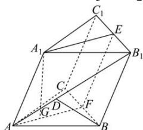
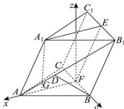

> [!faq]- 全练一本通解析
> **【答案】** （1） $\sqrt{3}$ ；（2）存在， $AD = \frac{\sqrt{13}}{3}$
>
> **【解析】**
> （1）记 $BC,B_{1}C_{1}$ 的中点分别为 $F,E$ 由 $BB_{1}C_{1}C$ 是正方形可知 $EF\bot BC$ 又 $AB = AC = \sqrt{5}$ ，所以 $AF\bot BC$ 因为二面角 $A - BC - B_{1}$ 的大小是 $\frac{2\pi}{3}$ ，所以 $\angle AFE = \frac{2\pi}{3}$ 由三棱柱性质可知， $EF / / AA_1,EF = AA_1$ ，所以四边形 $AA_{1}EF$ 为平行四边形，所以 $\angle A_{1}AF = \frac{\pi}{3}$ 因为 $EF\cap AF = A,EF,AF\subset$ 平面 $AA_{1}EF$ ，所以 $BC\bot$ 平面 $AA_{1}EF$ 又 $BC\subset$ 平面 $ABC$ ，所以平面 $ABC\bot$ 平面 $AA_{1}EF$ 作 $A_{1}G\bot AF$ 于点 $G$ 因为，平面 $ABC\cap$ 平面 $AA_{1}EF = AF$ ， $A_{1}G\subset$ 平面 $AA_{1}EF$ 所以 $A_{1}G\bot$ 平面 $ABC$ ，所以 $A_{1}G$ 即为所求，所以 $A_{1}G = AA_{1}\sin \frac{\pi}{3} = 2\times \frac{\sqrt{3}}{2} = \sqrt{3}$
> 
> (2)以 $\overrightarrow{FA},\overrightarrow{FB}$ 的方向分别为 x,y 轴的正方向, 过点 F 作垂直于平面 ABC 的直线为 z 轴, 建立空间直角坐标系,
> 易知， $AF=\sqrt{AB^{2}-BF^{2}}=2$ ，
> 则 $A(2,0,0), A_1(1,0,\sqrt{3}), C(0,-1,0), B(0,1,0), B_1(-1,1,\sqrt{3})$
> 则 $\overrightarrow{AA_1} = (-1,0,\sqrt{3}),\overrightarrow{AC} = (-2, - 1,0),\overrightarrow{BA} = (2, - 1,0),\overrightarrow{AB_1} = (-3,1,\sqrt{3})$
> 设 $\overrightarrow{AD} = \lambda \overrightarrow{AB_{1}}$
> $$
> \overrightarrow {B D} = \overrightarrow {B A} + \overrightarrow {A D} = \overrightarrow {B A} + \lambda \overrightarrow {A B _ {1}} = (2, - 1, 0) + \lambda (- 3, 1, \sqrt {3}) = (2 - 3 \lambda , \lambda - 1, \sqrt {3} \lambda)
> $$
> 设 $\vec{n} = (x,y,z)$ 为平面 $ACC_{1}A_{1}$ 的法向量，
> 则 $\left\{\begin{aligned}\overrightarrow{AC}\cdot\vec{n}&=-2x-y=0\\\overline{AA_{1}}\cdot\vec{n}&=-x+\sqrt{3}z=0\end{aligned}\right.$ ，取 $x=\sqrt{3}$ ，得 $\vec{n}=\left(\sqrt{3},-2\sqrt{3},1\right)$ ，
> 记直线 BD 与平面 $ACC_{1}A_{1}$ 所成角为 $\theta\left(0\leq\theta\leq\frac{\pi}{2}\right)$ ,
> $$
> \sin \theta = \left| \cos \overrightarrow {B D}, \vec {n} \right| = \frac {\left| \overrightarrow {B D} \cdot \vec {n} \right|}{\left| \overrightarrow {B D} \right| \cdot | \vec {n} |} = \frac {\sqrt {3} | 1 - \lambda |}{\sqrt {1 3 \lambda^ {2} - 1 4 \lambda + 5}}
> $$
> $$
> = \frac {\sqrt {3}}{\sqrt {\frac {4}{(1 - \lambda) ^ {2}} - \frac {1 2}{(1 - \lambda)} + 1 3}}
> $$
> 当 $\frac{1}{1 - \lambda} = \frac{3}{2}$ ，即 $\lambda = \frac{1}{3}$ 时， $\frac{4}{(1 - \lambda)^2} -\frac{12}{(1 - \lambda)} +13$ 取得最小值4,
> 故 $\sin \theta \leq \frac{\sqrt{3}}{2}$
> 所以, 当 $\lambda=\frac{1}{3}$ 时, 直线 BD 与平面 $ACC_{1}A_{1}$ 所成角为 $\frac{\pi}{3}$ .
> 此时 $\overrightarrow{AD} = \frac{1}{3}\overrightarrow{AB_1} = \left(-1,\frac{1}{3},\frac{\sqrt{3}}{3}\right),$
> 所以 $AD=\sqrt{1+\frac{1}{9}+\frac{1}{3}}=\frac{\sqrt{13}}{3}$ .
> 
