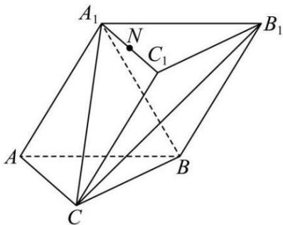

<!-- question-source:start -->
【17】（2024·青岛）如图，在三棱柱 $ABC-A_{1}B_{1}C_{1}$ 中， $AA_{1}$ 与 $BB_{1}$ 的距离为 $\sqrt{3}$ ， $AB=AC=A_{1}B=2$ ， $A_{1}C=BC=2\sqrt{2}$ .
（1）证明：平面 $A_{1}ABB_{1}\perp$ 平面 ABC；
(2) 若点 N 在棱 $A_{1}C_{1}$ 上，求直线 AN 与平面 $A_{1}B_{1}C$ 所成角的正弦值的最大值.

第八节 专题:夹角的范围与探索性问题大题专练
<!-- question-source:end -->

![[Q00005677A1]]
