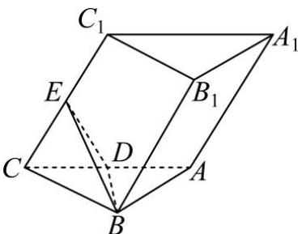

<!-- question-source:start -->
【18】如图,在三棱柱 $ABC-A_{1}B_{1}C_{1}$ 中,棱 $AC,CC_{1}$ 的中点分别为 D,E, $C_{1}$ 在平面 ABC 内的射影为 D, $\triangle ABC$ 是边长为 2 的等边三角形,且 $AA_{1}=2$ ,点 F 在棱 $B_{1}C_{1}$ 上运动（包括端点）.请建立适当的空间直角坐标系,解答下列问题:
（1）若点 F 为棱 $B_{1}C_{1}$ 的中点,求点 F 到平面 BDE 的距离;
（2）求锐二面角 F-BD-E 的余弦值的取值范围.

<!-- question-source:end -->

![[Q00005678A1]]
