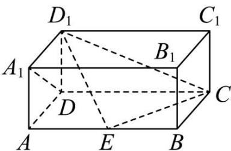

<!-- question-source:start -->
【19】(2024·广东)如图, 在长方体 $ABCD - A_{1}B_{1}C_{1}D_{1}$ 中, AD = AA\_{1} = 1, AB = 2, 点 E 在棱 AB 上移动.
（1）当点 E 在棱 AB 的中点时, 求平面 $D_{1}EC$ 与平面 $DCD_{1}$ 所成的夹角的余弦值;
(2) 当 AE 为何值时, 直线 $A_{1}D$ 与平面 $D_{1}EC$ 所成角的正弦值最小, 并求出最小值.

第八节 专题:夹角的范围与探索性问题大题专练
<!-- question-source:end -->

![[Q00005679A1]]
