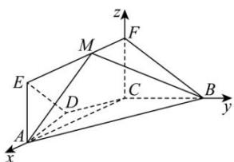

> [!faq]- 全练一本通解析
> **【答案】** （1）证明见解析（2） $\left[\frac{\sqrt{7}}{7},\frac{1}{2}\right]$
>
> **【解析】**
> （1）在梯形ABCD中，因为
> $AB//CD$ , AD = DC = CB = 1, $\angle ABC = 60^{\circ}$
> 所以 $AB = (1 \times \cos 60^{\circ}) \times 2 + 1 = 2$ ，所以
> $$
> A C ^ {2} = A B ^ {2} + B C ^ {2} - 2 A B \cdot B C \cdot \cos 6 0 ^ {\circ} = 3
> $$
> 所以 $AB^{2} = AC^{2} + BC^{2}$ ，所以 $BC\bot AC$
> 因为平面 $ACFE \perp$ 平面 ABCD，平面 $ACFE \cap$ 平面 ABCD = AC，
> 因为 $BC \subset$ 平面ABCD，所以 $BC \perp$ 平面ACFE.
> （2）由（1）可建立分别以直线 CA, CB, CF 为 x 轴, y 轴, z 轴的如图所示的空间直角坐标系,
> 令 $FM = \lambda (0\leq \lambda \leq \sqrt{3})$ ，则 $C(0,0,0),A(\sqrt{3},0,0),B(0,1,0),M(\lambda ,0,1)$
> $$
> \therefore \overrightarrow {A B} = (- \sqrt {3}, 1, 0), \overrightarrow {B M} = (\lambda , - 1, 1)
> $$
> 设 $\vec{n} = (x,y,z)$ 为平面 $MAB$ 的一个法向量，
> 由 $\left\{\begin{aligned}\vec{n}\cdot\overrightarrow{AB}&=0\\ \vec{n}\cdot\overrightarrow{BM}&=0\end{aligned}\right.$ 得 $\left\{\begin{aligned}-\sqrt{3}x+y&=0\\ \lambda x-y+z&=0\end{aligned}\right.$ ，取 x=1，则 $\vec{n}=\left(1,\sqrt{3},\sqrt{3}-\lambda\right)$ ,
> ∵ $\vec{m}=(1,0,0)$ 是平面 FCB 的一个法向量
> $$
> \therefore \cos \theta = \frac {| \vec {n} \cdot \vec {m} |}{| \vec {n} | \cdot | \vec {m} |} = \frac {1}{\sqrt {1 + 3 + (\sqrt {3} - \lambda) ^ {2}} \times 1} = \frac {1}{\sqrt {(\lambda - \sqrt {3}) ^ {2} + 4}}.
> $$
> $$
> \because 0 \leq \lambda \leq \sqrt {3}
> $$
> $$
> \lambda = 0
> $$
> $$
> \cos \theta
> $$
> $$
> \frac {\sqrt {7}}{7}
> $$
> $$
> \lambda = \sqrt {3}
> $$
> $$
> \cos \theta
> $$
> $$
> \frac {1}{2}
> $$
> $$
> \cos \theta \in \left[ \frac {\sqrt {7}}{7}, \frac {1}{2} \right]
> $$
> 
