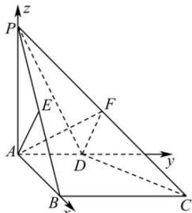

> [!faq]- 全练一本通解析
> **【答案】** （1）证明见解析（2） $\frac{\sqrt{6}}{6}$
>
> **【解析】**
> （1）证明: 因为 $PA \perp$ 平面 ABCD，且 $BC \subset$ 平面 ABCD，所以 $PA \perp BC$ .
> 因为 $AD \parallel BC$ ，且 $AD \perp AB$ ，所以 $BC \perp AB$ 。
> $$
> P A, A B \subset
> $$
> $$
> P A B
> $$
> $$
> P A \cap A B = A
> $$
> 因为 $AE \subset$ 平面 PAB，所以 $BC \perp AE$ 。
> $$
> B C \perp
> $$
> $$
> P A B
> $$
> 因为 PA = AB, E 是棱 PB 的中点, 所以 $AE \perp PB$ .
> $$
> P B, B C \subset
> $$
> $$
> P B C
> $$
> $$
> P B \cap B C = B
> $$
> $$
> A E \perp
> $$
> $$
> P B C
> $$
> （2）以 A 为坐标原点, 分别以 $\overrightarrow{AB}, \overrightarrow{AD}, \overrightarrow{AP}$ 的方向为 x, y, z 轴的正方向建立如图所示的空间直角坐标系.
> 
> 因为 AD=1，所以 $A(0,0,0)$ , $C(2,2,0)$ , $D(0,1,0)$ , $P(0,0,2)$ ，则
> $$
> \overrightarrow {A D} = (0, 1, 0), \overrightarrow {P C} = (2, 2, - 2), \overrightarrow {P D} = (0, 1, - 2)
> $$
> 因为点 F 在棱 PC 上, 所以 $\overrightarrow{PF} = \lambda \overrightarrow{PC} = (2\lambda, 2\lambda, -2\lambda)$ ,
> 则 $F(2\lambda, 2\lambda, -2\lambda + 2)$ ，故 $\overrightarrow{AF} = (2\lambda, 2\lambda, -2\lambda + 2)$ .
> 设平面 ADF 的法向量为 $\vec{m}=(x_{1},y_{1},z_{1})$
> 则 $\left\{\begin{aligned}\vec{m}\cdot\overrightarrow{AD}=y_{1}&=0\\\vec{m}\cdot\overrightarrow{AF}=2\lambda x_{1}+2\lambda y_{1}+\left(-2\lambda+2\right)z_{1}&=0\end{aligned}\right.$ ，令 $x_{1}=\lambda-1$ ，得 $\overrightarrow{m}=\left(\lambda-1,0,\lambda\right)$ .
> 设平面 PCD 的法向量为 $\vec{n}=(x_{2},y_{2},z_{2})$ ,
> 则 $\left\{ \begin{array}{l} \vec{n} \cdot \overrightarrow{PD} = y_2 - 2z_2 = 0 \\ \vec{n} \cdot \overrightarrow{PC} = 2x_2 + 2y_2 - 2z_2 = 0 \end{array} \right.$ ，令 $x_2 = 1$ ，得 $\vec{n} = (1, -2, -1)$ .
> 设平面 $ADF$ 与平面 $PCD$ 的夹角为 $\theta$
> $$
> \cos \theta = \left| \cos (\overrightarrow {m}, \overrightarrow {n}) \right| = \frac {\left| \overrightarrow {m} \cdot \overrightarrow {n} \right|}{\left| \overrightarrow {m} \right| \left| \overrightarrow {n} \right|} = \frac {1}{\sqrt {(\lambda - 1) ^ {2} + \lambda^ {2}} \times \sqrt {1 + 4 + 1}} = \frac {1}{\sqrt {1 2 \left[ \left(\lambda - \frac {1}{2}\right) ^ {2} + \frac {1}{4} \right]}}
> $$
> 因为 $0 \leqslant \lambda \leqslant 1$ ，所以 $\frac{1}{4} \leqslant \left( \lambda - \frac{1}{2} \right)^2 + \frac{1}{4} \leqslant \frac{1}{2}$ ，所以
> $$
> \sqrt {3} \leqslant \sqrt {1 2 \left[ \left(\lambda - \frac {1}{2}\right) ^ {2} + \frac {1}{4} \right]} \leqslant \sqrt {6}
> $$
> 所以 $\frac{\sqrt{6}}{6}\leqslant\frac{1}{\sqrt{12\left[\left(\lambda-\frac{1}{2}\right)^{2}+\frac{1}{4}\right]}}\leqslant\frac{\sqrt{3}}{3}$ ，即 $\frac{\sqrt{6}}{6}\leqslant\cos\theta\leqslant\frac{\sqrt{3}}{3}$
> $$
> A D F
> $$
> $$
> \frac {\sqrt {6}}{6}
> $$
