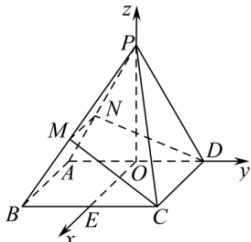

> [!faq]- 全练一本通解析
> **【答案】** （1）证明见解析（2） $(0,\frac{\sqrt{15}}{5}]$
>
> **【解析】**
> （1）证明：因为四边形 ABCD 是矩形，所以 AB // CD。
> 又 AB ⊂ 平面 PAB，CD ≠ 平面 PAB，且 AB // CD。
> 所以 CD // 平面 PAB。
> 因为 $CD \subset \alpha$ ，平面 $PAB \cap \alpha = MN$ ，且 $CD \parallel$ 平面 $PAB$ 。所以 $CD \parallel MN$ ，且 $MN \perp PA$ ，所以 $CD \perp PA$ 。因为四边形 $ABCD$ 为矩形，所以 $CD \perp AD$ ，又 $PA \subset$ 平面 $PAD$ ， $AD \subset$ 平面 $PAD$ ，且 $PA \cap AD = A$ ， $CD \perp PA$ ， $CD \perp AD$ ，所以 $CD \perp$ 平面 $PAD$ ，且 $PD \subset$ 平面 $PAD$ ，所以 $CD \perp PD$ 。（2）设 $AD, BC$ 中点分别为 $O, E$ ，因为 $\triangle PAD$ 是等边三角形，所以 $PO \perp AD$ 。因为四边形 $ABCD$ 是矩形，点 $O, E$ 分别为 $AD, BC$ 的中点，所以 $OE \perp OD$ ，且 $OE \parallel CD$ 。由（1）可知， $CD \perp$ 平面 $PAD$ ，又 $PO \subset$ 平面 $PAD$ ，所以 $CD \perp PO$ ，所以 $OE \perp PO$ 。以 $O$ 为原点， $\overrightarrow{OE}, \overrightarrow{OD}, \overrightarrow{OP}$ 的方向分别为 $x$ 轴， $y$ 轴， $z$ 轴的正方向建立空间直角坐标系 $O - xyz$ ，
> 
> 则 $P(0,0,\sqrt{3}), B(1,-1,0), C(1,1,0), D(0,1,0)$ .
> 设 $\overrightarrow{PM} = \lambda \overrightarrow{PB} (0 < \lambda \leq 1)$ ，则 $\overrightarrow{PM} = (\lambda, -\lambda, -\sqrt{3}\lambda)$ ，所以 $M(\lambda, -\lambda, \sqrt{3} - \sqrt{3}\lambda)$ .
> 设平面 $\alpha$ 的一个法向量为 $\vec{n} = (x, y, z)$ ，又 $\overrightarrow{CD} = (-1,0,0), \overrightarrow{CM} = (\lambda - 1, -\lambda - 1, \sqrt{3} - \sqrt{3}\lambda), \overrightarrow{PC} = (1,1, -\sqrt{3})$ ，
> 由 $\left\{\frac{\overrightarrow{CD} \cdot \vec{n}}{\overrightarrow{CM} \cdot \vec{n}} = 0, \right.$ 得： $\left\{-x = 0\right.$ 不妨取 $z = \lambda + 1$ ，可得平面 $\alpha$ 的一个法向量为 $\vec{n} = (0, \sqrt{3} - \sqrt{3}\lambda, \lambda + 1)$ .
> 设直线 $PC$ 与平面 $\alpha$ 所成的角为 $\theta$ ，
> 则 $\sin\theta = |\cos\overrightarrow{PC}, \vec{n}| = \left|\frac{\overrightarrow{PC} \cdot \vec{n}}{| \overrightarrow{PC} | \cdot |\vec{n}|}\right| = \frac{2\sqrt{3}\lambda}{2\sqrt{5} \cdot \sqrt{\lambda^2 - \lambda + 1}}$ .
> 设 $f(\lambda) = \frac{\lambda}{\sqrt{\lambda^2 - \lambda + 1}}$ ，
> 则 $f(\lambda) = \frac{\lambda}{\sqrt{\lambda^2 - \lambda + 1}} = \sqrt{\frac{\lambda^2}{\lambda^2 - \lambda + 1}} = \sqrt{\frac{1}{\frac{1}{\lambda^2} - \frac{1}{\lambda} + 1}} = \sqrt{\left(\frac{1}{\lambda} - \frac{1}{2}\right)^2 + \frac{3}{4}}$ 。
> 因为 $0 < \lambda \leq 1$ ，所以 $\frac{1}{\lambda} \geq 1$ ，所以 $0 < f(\lambda) \leq 1$ ，
> 所以 $0 < \sin\theta \leq \frac{\sqrt{15}}{5}$ ,
> 所以直线 $PC$ 与平面 $\alpha$ 所成角的正弦值的取值范围为 $(0, \frac{\sqrt{15}}{5}]$ .
