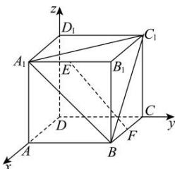

> [!faq]- 全练一本通解析
> **【答案】** （1）（i） $\frac{\sqrt{2}}{3}$ ；（ii） $\frac{\sqrt{3}}{3}$ （2） $\left(\frac{\sqrt{10}}{10}, \frac{\sqrt{2}}{2}\right)$
>
> **【解析】**
> （1）在正方体 $ABCD - A_1B_1C_1D_1$ 中以 $DA, DC, DD_1$ 分别为 $x, y, z$ 轴建立空间直角坐标系，如图所示
> 
> 设正方体 $ABCD-A_{1}B_{1}C_{1}D_{1}$ 的棱长为 2，
> 若 E 为棱 $A_{1}B_{1}$ 的中点，则 $E(2,1,2),F(1,2,0),B(2,2,0),A_{1}(2,0,2),C_{1}(0,2,2)$ 所以 $\overrightarrow{AC_{1}} = (-2, 2, 0), \overrightarrow{BA_{1}} = (0, -2, 2), \overrightarrow{FE} = (1, -1, 2)$ .
> （i）设平面 $A_{1}BC_{1}$ 的一个法向量为 $\vec{n} = (x,y,z)$ 则 $\left\{ \begin{array}{l}\vec{n}\cdot \overrightarrow{A_1C_1} = 0,\\ \vec{n}\cdot \overrightarrow{BA_1} = 0, \end{array} \right.$ 即 $\left\{ \begin{array}{l} - 2x + 2y = 0,\\ -2x + 2z = 0, \end{array} \right.$ 令 $x = 1$ ，则 $\vec{n} = (1,1,1)$ 设 $EF$ 与平面 $A_{1}BC_{1}$ 所成角为 $\alpha$ ，则有 $\sin \alpha = |\cos \vec{n},\overline{FE}| = \frac{|\vec{n}\cdot\overline{FE}|}{|\vec{n}||\overline{FE}|} = \frac{2}{\sqrt{3}\cdot\sqrt{6}} = \frac{\sqrt{2}}{3}.$ 故直线 $EF$ 与平面 $A_{1}BC_{1}$ 所成角的正弦值为 $\frac{\sqrt{2}}{3}$ （ii）易知平面 $AC$ 的一个法向量为 $\vec{m} = (0,0,1)$ 设平面 $A_{1}BC_{1}$ 和平面 $AC$ 的夹角为 $\beta$ ，则有 $\cos \beta = |\cos \langle \vec{m},\vec{n}\rangle | = \frac{|\vec{m}\cdot\vec{n}|}{|\vec{m}||\vec{n}|} = \frac{1}{\sqrt{3}} = \frac{\sqrt{3}}{3}.$ 故平面 $A_{1}BC_{1}$ 和平面 $AC$ 的夹角的余弦值为 $\frac{\sqrt{3}}{3}$ （2）设直线 $EF$ 与 $A_{1}C_{1}$ 所成角为 $\theta ,E(2,m,2)(0 <   m <   2)$ ，则 $\overline{FE} = (1,m - 2,2)$ 所以 $\cos \theta = |\cos \overline{A_1C_1},\overline{FE}| = \frac{|\overline{A_1C_1}\cdot\overline{FE}|}{|\overline{A_1C_1}||\overline{FE}|} = \frac{|2m - 6|}{2\sqrt{2}\cdot\sqrt{(m - 2)^2 + 5}}$ $= \frac{1}{\sqrt{2}}\cdot \sqrt{\frac{m^2 - 6m + 9}{m^2 - 4m + 9}} = \frac{1}{\sqrt{2}}\cdot \sqrt{1 - \frac{2}{m + \frac{9}{m} - 4}}.$ 因为 $0 <   m <   2$ ，所以 $m + \frac{9}{m} >\frac{5}{2}$ ，即 $\frac{1}{5} <  1 - \frac{2}{m + \frac{9}{m} - 4} <  1$ ，于是有 $\frac{1}{\sqrt{5}} <  \sqrt{1 - \frac{2}{m + \frac{9}{m} - 4}} <  1,$ 所以 $\frac{\sqrt{10}}{10} <  \frac{1}{\sqrt{2}}\cdot \sqrt{1 - \frac{2}{m + \frac{9}{m} - 4}} <   \frac{\sqrt{2}}{2}$ ，即 $\frac{\sqrt{10}}{10} <  \cos \theta <  \frac{\sqrt{2}}{2}$ 故直线 $EF$ 与 $A_{1}C_{1}$ 所成角余弦值的取值范围为 $\left(\frac{\sqrt{10}}{10},\frac{\sqrt{2}}{2}\right)$
