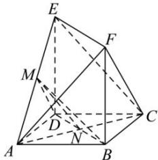
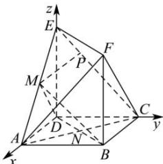

> [!faq]- 全练一本通解析
> **【答案】** （1）证明见解析（2） $\frac{2\sqrt{2}}{3}$
>
> **【解析】**
> （1）因为 $|BF|=|DE|$ ，BF//DE，所以四边形BDEF为平行四边形，故BD//EF，
> 又 BD∉平面 CEF，EF⊂平面 CEF，所以 BD//平面 CEF；
> 连接 AC 交 BD 于 N，连接 MN，因为四边形 ABCD 是正方形，故 N 为 AC 中点，
> M 是 AE 的中点，在 $\triangle ACE$ 中，有 MN // EC，MN ∉ 平面 CEF，EC ⊂ 平面 CEF，
> 所以 MN // 平面 CEF，且 BD ⊂ 平面 BDM，MN ⊂ 平面
> BDM，BD∩MN=N，
> 所以平面 BDM//平面 CEF.
> 
> （2）如图，建立空间直角坐标系，设 $|DE| = a$ ， $|AB| = 2$ 则 $B(2,2,0), C(0,2,0), F(2,2,a), A(2,0,0), E(0,0,a)$ ，又 $M$ 是 $AE$ 的中点，故 $M\left(1,0,\frac{a}{2}\right)$ ， $\overrightarrow{BM} = \left(-1,-2,\frac{a}{2}\right), \overrightarrow{CF} = (2,0,a)$ ，因为 $BM \perp CF$ 所以 $\overrightarrow{BM} \cdot \overrightarrow{CF} = -2 + \frac{a^2}{2} = 0$ ，解得 $a = 2$ ，设 $P(x,y,z)$ ，因点 $P$ 为线段 $CE$ 上一点，则 $\overrightarrow{CP} = m\overrightarrow{CE}, m \in [0,1]$ ，即 $\overrightarrow{CP} = (x,y-2,z) = m\overrightarrow{CE} = m(0,-2,2)$ ，故 $x = 0, y = 2-2m, z = 2m$ ，所以 $\overrightarrow{MP} = (-1,2-2m,2m-1)$ ，又 $\overrightarrow{AF} = (0,2,2), \overrightarrow{AE} = (-2,0,2)$ ，设平面 $AEF$ 的一个法向量为 $\vec{n} = (x_1,y_1,z_1)$ ，则 $\left\{\vec{n} \perp \overrightarrow{AF}, \vec{n} \perp \overrightarrow{AE}\right.$ ，即 $\left\{\vec{n} \cdot \overrightarrow{AF} = 2y_1 + 2z_1 = 0\right.$ ，令 $z_1 = 1$ ，则 $x_1 = 1, y_1 = -1$ ，即 $\vec{n} = (1,-1,1)$ ，设直线 $PM$ 与平面 $AEF$ 所成角为 $\theta$ ，则 $\sin \theta = |\cos \vec{n}, \overrightarrow{MP}| = \left|\frac{\vec{n} \cdot \overrightarrow{MP}}{|\vec{n}| \cdot |\overrightarrow{MP}|}\right| = \frac{|4m-4|}{\sqrt{3} \cdot \sqrt{1 + (2-2m)^2 + (2m-1)^2}} = \frac{2\sqrt{6}}{3} \cdot \frac{|m-1|}{\sqrt{4m^2 - 6m + 3}} = \frac{2\sqrt{6}}{3} \sqrt{\frac{(m-1)^2}{4(m-1)^2 + 2(m-1) + 1}}$ 当 $m \neq 1$ 时 $\frac{(m-1)^2}{4(m-1)^2 + 2(m-1) + 1} = \frac{1}{\left(\frac{1}{m-1}\right)^2 + 2\frac{1}{m-1} + 4}$ ，设 $t = \frac{1}{m-1}$ ， $\because m \in [0,1), \therefore t \in (-\infty,-1]$ ，所以 $\frac{1}{\left(\frac{1}{m-1}\right)^2 + 2\frac{1}{m-1} + 4} = \frac{1}{t^2 + 2t + 4}$ ，当 $t = -1$ 时 $\left(\frac{1}{t^2 + 2t + 4}\right)_{\max} = \frac{1}{3}$ ，所以 $(\sin \theta)_{\max} = \frac{2\sqrt{6}}{3} \cdot \sqrt{\frac{1}{3}} = \frac{2\sqrt{2}}{3}$ ，当 $m = 1$ 时， $\sin \theta = 0$ ，所以直线 $PM$ 与平面 $AEF$ 所成角的正弦值的最大值为 $\frac{2\sqrt{2}}{3}$ .
> 
